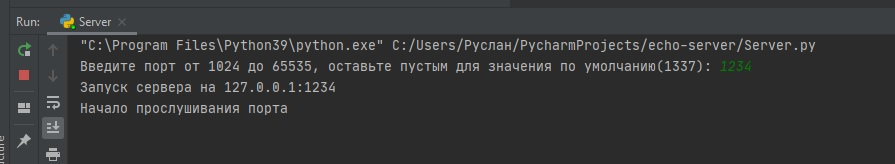
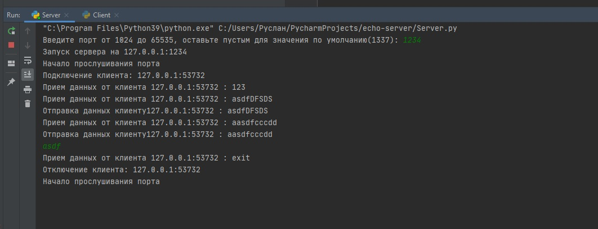
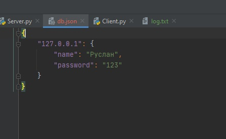
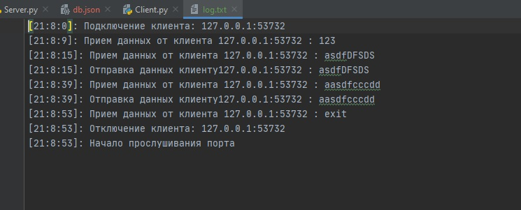

# Эхо сервер
Инициализация сервера

Здесь видно что сервер спрашивает на каком порту его создавать, значение по умолчанию

Далее идет подключение клиента:

Выбираем ip и порт подключения, также есть значения по умолчанию
После подключения нужна авторизация, так как клиент уже зарегистрирован
Далее уже можно отправлять сообщения и получать их уже обработанными
Для завершения прописываем exit и отключаемся от сервера

Как реагирует на это уже сам сервер:

Здесь виден файл с зарегистрированными пользователями

Все происходящее безусловно записывется в log файл

